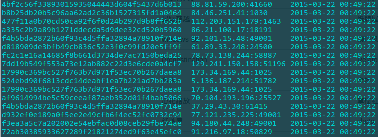

#A powerful DHT crawler

##PREFACE
The program is based on [distributed hash table (DHT)](http://www.bittorrent.org/beps/bep_0005.html).

And you can access the example site: http://www.soqoo.net/

##HOW TO
I used thread pool to process the request/response, I found a man used thread Mixin's SocketServer, it's so violence, some server can not hold on ...

In this repo, I didn't implements Bloom Filter or other 'infohash' reduplication removing algorithm and not store data in file or database, default to print it. So you can do those things in subclass of "handler.Handler", as you wish.


There is a simple example for single thread:
```Python
import os

from powerdht.app import App
from powerdht.handler import StreamHandler, FileHandler


if __name__ == '__main__':
    App.configure_options(
        host='0.0.0.0',
        port=6881,
        node_size=100000,
        log_file_prefix='dht.log')
    app = App.instance("SingleThread")
    app.add_handler(StreamHandler())
    app.add_handler(
        FileHandler(os.path.join(os.path.dirname(__file__), 'infohash.txt')))
    try:
    	app.startd()
	except KeyboardInterrupt:
		print('\nStoping...\n')
		app.stopd()
```
There is a example for thread pool:
```Python
import os

from powerdht.app import App
from powerdht.handler import StreamHandler, FileHandler


if __name__ == '__main__':
    App.configure_options(
        host='0.0.0.0',
        port=6881,
        node_size=100000,
        thread_num=8,
        q_size=200,
        log_level="warning",
        log_file_prefix='dht.log')
    app = App.instance("MultiThread")
    app.add_handler(StreamHandler())
    app.add_handler(
        FileHandler(os.path.join(os.path.dirname(__file__), 'infohash.txt')))
    try:
    	app.startd()
    except KeyboardInterrupt:
		print('\nStoping...\n')
		app.stopd()
```


##LICENSE

[The BSD 3-Clause License](./LICENSE)

***

2015.6 ChangSha