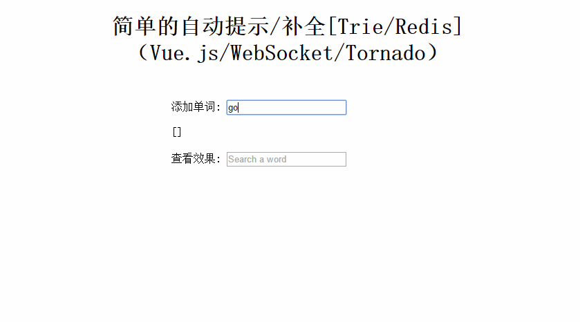

两种方式：
- `Trie`：前缀树。[use_trie/trie.py](https://github.com/Damnever/Note/blob/master/autocomplete/use_trie/trie.py)
- `Redis`：使用 SortedSet 和 HASH。[use_redis/rds.py](https://github.com/Damnever/Note/blob/master/autocomplete/use_redis/rds.py)

---

使用基于`Trie`的示例：
```
ptyhon app.py --use=trie
```

使用基于`Redis`的示例：
```
python app.py --use=redis
```

浏览器访问：http://localhost:9487/


